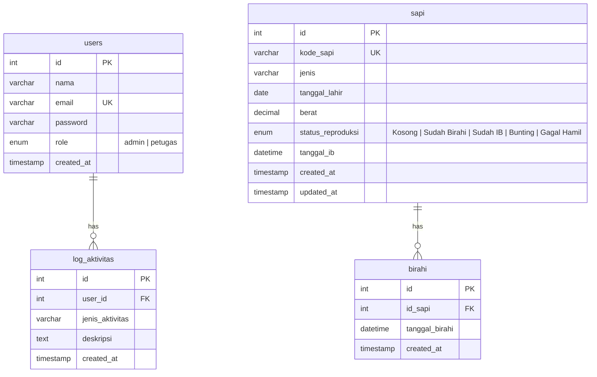

# 🐄 CattlePro — Cattle Reproduction Management System

<div align="center">

**Sistem Manajemen Reproduksi Sapi Berbasis Web**


</div>

---

## 📋 Deskripsi

**CattlePro** adalah aplikasi web berbasis PHP yang dirancang untuk membantu peternak dan petugas peternakan dalam mengelola siklus reproduksi sapi secara digital. Aplikasi ini menyediakan fitur pencatatan, pemantauan, dan prediksi reproduksi sapi secara *realtime*, mulai dari deteksi **birahi**, **inseminasi buatan (IB)**, **pemeriksaan kebuntingan (PKB)**, hingga **pelaporan kelahiran**.

Dengan antarmuka modern dan responsif, CattlePro membantu meningkatkan efisiensi manajemen reproduksi dan mengurangi risiko kegagalan program breeding.

---

## ✨ Fitur Utama

### 🏠 Dashboard Overview
- **Statistik populasi** — Menampilkan jumlah total sapi, sapi birahi, menunggu PKB, bunting, dan gagal hamil.
- **Grafik distribusi** — Visualisasi bar chart interaktif menggunakan Chart.js untuk melihat distribusi status reproduksi.
- **Notifikasi cerdas** — Sistem alert otomatis untuk:
  - ⏰ Sapi dalam masa birahi optimal (perlu IB segera)
  - 📅 Jadwal PKB yang mendekati (H-15 hari)
  - 🍼 Estimasi kelahiran yang mendekat (H-30 hari)
- **Log aktivitas** — Timeline terbaru dari seluruh aktivitas pencatatan reproduksi.
- **Pintasan cepat** — Akses langsung ke modul Kelola Sapi, Live Tracker, Pemeriksaan, dan Cetak Laporan.

### 🐮 Manajemen Data Sapi
- **CRUD lengkap** — Tambah, lihat, edit, dan hapus data sapi.
- **Pencarian** — Cari sapi berdasarkan kode atau jenis.
- **Informasi detail** — Kode sapi, jenis (Limousin, Simental, Brahman, Angus, PO, Bali, Madura, dll.), tanggal lahir, berat badan, dan status reproduksi.
- **Status badge** — Indikator visual berwarna untuk setiap status reproduksi.
- **Tracking admin** — Mencatat admin terakhir yang mengelola data sapi.

### 🔬 Detail Sapi & Smart Cycle Reproduksi
Halaman detail setiap sapi dilengkapi dengan **Smart Cycle** yang mengikuti alur reproduksi secara bertahap:

| Tahap | Status | Aksi |
|-------|--------|------|
| 1️⃣ | **Kosong** | Form lapor birahi (tanggal + jam opsional) |
| 2️⃣ | **Sudah Birahi** | Form input inseminasi buatan (IB) + jadwal IB optimal (H+12 jam) |
| 3️⃣ | **Sudah IB** | Form input hasil PKB + jadwal pantau H+21 & H+60 |
| 4️⃣ | **Bunting** | Form pelaporan kelahiran + estimasi HPL (H+283 hari) |
| 5️⃣ | **Gagal Hamil** | Evaluasi & reset status untuk siklus baru |

Setiap tahap dilengkapi dengan:
- 💡 **Instruksi otomatis** — Panduan tindakan selanjutnya berdasarkan status terkini.
- ↩️ **Tombol batal** — Kemampuan untuk membatalkan dan mundur ke tahap sebelumnya.
- 📜 **Arsip histori birahi** — Log diagnostik seluruh riwayat birahi sapi.

### 📡 Monitoring & Live Tracker
- **Progress reproduksi realtime** — Tabel monitoring seluruh sapi dengan status terkini.
- **Jadwal tindakan** — Menampilkan jadwal IB optimal, pantau birahi ulang (H+21), cek PKB (H+60), dan estimasi kelahiran (HPL).
- **Update terakhir** — Informasi waktu terakhir perubahan status setiap sapi.

### 🧮 Prediksi Kesiapan Reproduksi
Algoritma scoring otomatis berdasarkan 3 parameter:

| Parameter | Bobot Maks | Kriteria Optimal |
|-----------|-----------|-----------------|
| **Umur** | 40 poin | 15–18 bulan |
| **Berat Badan** | 30 poin | 300–400 kg |
| **Siklus Birahi** | 30 poin | Siklus 18–24 hari (≥3 data) |

- **Skor ≥ 60**: ✅ *SIAP REPRODUKSI*
- **Skor < 60**: ⚠️ *BELUM OPTIMAL*

### 👥 Manajemen User
- **Multi-role** — Mendukung role `admin` dan `petugas`.
- **CRUD user** — Admin dapat menambah dan menghapus user.
- **Proteksi** — Admin tidak bisa menghapus akun sendiri.
- **Hak akses** — Hanya admin yang dapat mengakses halaman manajemen user.

---

## 🏗️ Arsitektur & Struktur Proyek

Proyek ini menggunakan arsitektur **MVC sederhana** (tanpa framework) dengan struktur sebagai berikut:

```
cattlepro/
├── 📁 components/          # Komponen UI yang dapat digunakan ulang
│   ├── sidebar.php         # Sidebar navigasi desktop + bottom nav mobile
│   └── profile_dropdown.php # Dropdown profil user
│
├── 📁 controllers/         # Logic controller & konfigurasi
│   ├── Database.php        # Koneksi database PDO (MySQL)
│   └── main.php            # Bootstrap utama (session, DB, model init)
│
├── 📁 database/            # Skema database
│   └── cattlepro.sql       # SQL schema + data default
│
├── 📁 models/              # Model data
│   └── Sapi.php            # Model CRUD sapi, birahi, prediksi, log aktivitas
│
├── index.php               # Halaman login & registrasi
├── dashboard.php           # Dashboard overview dengan statistik & grafik
├── sapi.php                # Halaman kelola data sapi (CRUD)
├── detail_sapi.php         # Detail sapi + Smart Cycle reproduksi
├── prediksi.php            # Monitoring & live tracker reproduksi
├── users.php               # Manajemen user (admin only)
└── logout.php              # Proses logout
```

---

## 🛠️ Tech Stack

| Teknologi | Keterangan |
|-----------|-----------|
| **PHP 8.x** | Backend server-side |
| **MySQL / MariaDB** | Database relasional |
| **PDO** | Database abstraction layer (prepared statements) |
| **Tailwind CSS (CDN)** | Utility-first CSS framework untuk styling |
| **Chart.js** | Library visualisasi data (grafik bar) |
| **Font Awesome 6** | Icon library |
| **Plus Jakarta Sans** | Custom font via Google Fonts |

---

## 📦 Instalasi & Setup

### Prasyarat
- PHP >= 8.0
- MySQL / MariaDB
- Web server (Apache / Nginx / XAMPP / Laragon)

### Langkah Instalasi

1. **Clone repository** ke direktori web server:
   ```bash
   git clone https://github.com/username/cattlepro.git
   cd cattlepro
   ```

2. **Import database** — Jalankan file SQL untuk membuat database dan tabel:
   ```bash
   mysql -u root -p < database/cattlepro.sql
   ```
   Atau import melalui **phpMyAdmin** dengan mengupload file `database/cattlepro.sql`.

3. **Konfigurasi database** — Edit file `controllers/Database.php` sesuai environment:
   ```php
   private $host = "localhost";
   private $db_name = "cattlepro";
   private $username = "root";
   private $password = "";
   ```

4. **Akses aplikasi** melalui browser:
   ```
   http://localhost/cattlepro/
   ```

### 🔑 Akun Default

| Field | Value |
|-------|-------|
| **Email** | `admin@cattlepro.com` |
| **Password** | `admin123` |
| **Role** | Admin |

---

## 📱 Responsivitas

CattlePro didesain **mobile-first** dan mendukung:
- 🖥️ **Desktop** — Sidebar navigasi di sisi kiri dengan layout penuh.
- 📱 **Mobile** — Bottom navigation bar otomatis menggantikan sidebar pada layar kecil (`< 768px`).

---

## 🗄️ Skema Database

Aplikasi menggunakan 4 tabel utama:



---

## 🔄 Alur Siklus Reproduksi

```
┌─────────┐   Deteksi    ┌──────────────┐   Tindakan   ┌──────────┐
│  KOSONG  │ ──────────►  │ SUDAH BIRAHI │ ──────────►  │ SUDAH IB │
└─────────┘   Birahi      └──────────────┘     IB       └──────────┘
     ▲                                                       │
     │                                                  PKB (H+60)
     │                                                       │
     │         ┌──────────────┐                    ┌─────────┴──────────┐
     │         │  GAGAL HAMIL │ ◄── Gagal ────────│   Hasil PKB?       │
     │         └──────┬───────┘                    └─────────┬──────────┘
     │                │ Reset                            Bunting
     │                │                                      │
     │                ▼                               ┌──────▼───────┐
     └──────────── KOSONG ◄── Lahir ──────────────── │   BUNTING    │
                                                      │  (HPL H+283) │
                                                      └──────────────┘
```

---

## 🔒 Keamanan

- ✅ **Password hashing** — Menggunakan `password_hash()` dan `password_verify()` (bcrypt).
- ✅ **Prepared statements** — Semua query menggunakan PDO prepared statements untuk mencegah SQL Injection.
- ✅ **Input sanitization** — Data input disanitasi menggunakan `htmlspecialchars()` dan `strip_tags()`.
- ✅ **Session-based authentication** — Proteksi halaman dengan validasi session.
- ✅ **Role-based access** — Halaman manajemen user hanya dapat diakses oleh admin.

---

## 📄 Lisensi

Proyek ini dibuat untuk keperluan edukasi dan manajemen peternakan. Silakan gunakan dan modifikasi sesuai kebutuhan.

---

<div align="center">

**Made with ❤️ for Indonesian Cattle Farmers**

🐄 *CattlePro — Kelola Reproduksi Sapi Lebih Cerdas* 🐄

</div>
